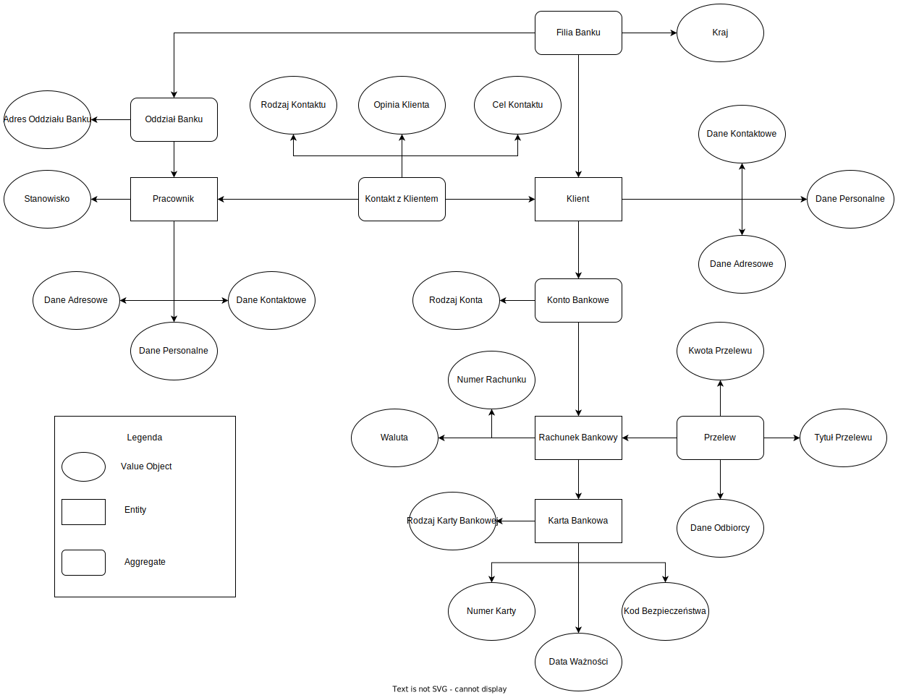
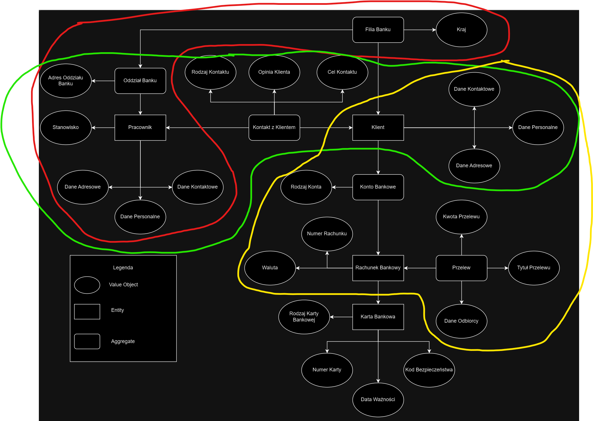

### 1. Opis zadania

Celem zadania jest przygotowanie fragmentu modelu bezpiecznej aplikacji bankowej wykorzystując zasady
Domain Driven Design.  
Zadanie składa się z 3 części:

1. Zdefiniowane kontekstów w obrębie systemu bankowego
2. Zamodelowanie agregatów, encji i obiektów wartości
3. Zdefiniowanie przyjętych założeń

### 2. Konteksty w obrębie aplikacji

- Obsługa klienta
- Zarządzanie pracownikami
- Zarządzanie danymi jako klient (adresowymi, kontaktowymi)
- Zarządzanie kontami (prywatnymi, firmowymi)
- Zarządzanie rachunkami (różne waluty)
- Zarządzanie kartami (debetowymi, kredytowymi)
- Zarządzanie przelewami (między kontami danego klienta, wewnątrzbankowymi, krajowymi, międzynarodowymi)
- Uwierzytelnianie (różne metody np. biometria, pin, hasło)
- Wypłaty bankomatowe
- Wypłaty w oddziałach bankowych
- Wpłaty bankowe
- Wpłaty w oddziałach bankowych
- Płatności mobilne (integracja z płatnościami mobilnymi np. Google Pay, płatność kodem QR)
- Weryfikacja płatności internetowych (potwierdzanie użycia karty w sklepie internetowym, potwierdzenie Blika itp.)
- Udzielanie pożyczek
- Udzielanie kredytów
- Kantor internetowy
- Konta maklerskie
- ...

W dalszych punktach skupię się na części systemu związanym z obsługą klienta, zarządzaniem danymi klienta, rachunkami,
kartami i
przelewami.

### 3. Model agregatów, encji i obiektów wartości

##### Model:

##### Model z zaznaczonymi przykładowymi kontekstami

Kolory:

- czerwony - kontekst zarządzania pracownikami
- zielony - kontekst obsługi klienta
- żółty - kontekst przelewów
  

### 4. Zdefiniowanie przyjętych założeń

*Filia Banku* ===========================================================================

Reprezentuje filię banku w danym kraju.  
Agreguje pod sobą oddziały banku w danym kraju oraz klientów z danego kraju.  

Atrybuty:
- Oddziały Banku
- kraj (typ enum z wartościami skrótów odpowiadającymi krajom, w których bank ma swoje filie)

Operacje:

- dodawanie/usuwanie oddziałów banku
- dodawanie klientów
- deaktywacja klientów (oznacza, że klient stał się byłym klientem)
- usuwanie danych klienta (po spełnieniu wymogów co do długości przechowywania danych zależnych od kraju,
  w którym dana filia się znajduje)

*Oddział Banku* =========================================================================

Reprezentuje fizyczny oddział banku pod szyldem danej filii banku.  

Atrybuty:

- Pracownicy
- Adres Oddziału Banku
    - region (string 0-255)
    - miejscowość (string 0-255)
    - ulica (string 0-255)
    - nr budynku (string 0-255; string bo nr może mieć litery)
    - nr lokalu (string 0-255; opcjonalny; string bo nr może mieć litery)

Operacje:

- zatrudnij/zwolnij pracownika

*Pracownik* =========================================================================

Reprezentuje fizycznego pracownika oddziału banku.  

Atrybuty:

- UUID (typ uuid)
- Kontakty z klientem
- Stanowisko (enum zawierający wszystkie dostępne pozycje w banku)
- Dane Adresowe
    - kraj (typ enum z wartościami skrótów odpowiadającymi krajom)
    - region (string 0-255)
    - miejscowość (string 0-255)
    - ulica (string 0-255)
    - nr budynku (string 0-255; string bo nr może mieć litery)
    - nr lokalu (string 0-255; opcjonalny; string bo nr może mieć litery)
- Dane Personalne
    - Imiona (string 0-255)
    - Nazwisko (string 0-255)
    - Data Urodzenia (typ Date)
    - Nr identyfikacyjny (string 0-255; walidacja na podstawie regexa zależnego od kraju, w którym znajduje się filia
      banku; np. w Polsce byłby to pesel)
- Dane Kontaktowe
  - email (string 0-255; regex sprawdzający poprawność adresu)
  - nr telefonu (string 0-20; regex)

Operacje:

- nawiąż kontakt z klientem (np. w celu marketingowym nowej usługi)
- odpowiedz na zapytanie klienta

*Kontakt z Klientem* =========================================================================

Reprezentuje kontakt między pracownikiem banku a klientem.  
Może to być kontakt w celu marketingowym zainicjowany przez pracownika lub kontakt ze strony klienta.

Atrybuty:

- Klient
- Pracownik
- Rodzaj Kontaktu
  - rodzaj (enum; np. WORKER_INIT, CLIENT_INIT)
- Cel Kontaktu
  - cel (enum z możliwymi celami)
  - opis (opcjonalny opis; string 0-4000)
- Opinia Klienta
  - ocena (int; 0-5)
  - opinia (string 0-4000; opcjonalna)

Operacje:

- deleguj pracownika do odpowiedzi
- odpowiedz na kontakt

*Klient* =========================================================================

Reprezentuje fizycznego klienta banku.  

Atrybuty:

- UUID (typ uuid)
- Konta Bankowe (max 1 osobiste i 1 firmowe)
- Dane Adresowe
  - kraj (typ enum z wartościami skrótów odpowiadającymi krajom)
  - region (string 0-255)
  - miejscowość (string 0-255)
  - ulica (string 0-255)
  - nr budynku (string 0-255; string bo nr może mieć litery)
  - nr lokalu (string 0-255; opcjonalny; string bo nr może mieć litery)
- Dane Personalne
  - Imiona (string 0-255)
  - Nazwisko (string 0-255)
  - Data Urodzenia (typ Date)
  - Nr identyfikacyjny (string 0-255; walidacja na podstawie regexa zależnego od kraju, w którym znajduje się filia
    banku; np. w Polsce byłby to pesel)
- Dane Kontaktowe
  - email (string 0-255; regex sprawdzający poprawność adresu)
  - nr telefonu (string 0-20; regex)

Operacje:

- zaaktualizuj dane kontaktowe
- zaaktualizuj dane adresowe
- załóż konto prywatne (istnieje możliwość założenia 1 konta prywatnego przez 1 klienta)
- załóż konto firmowe (istnieje możliwość założenia 1 konta firmowego przez 1 klienta)

*Konto Bankowe* =========================================================================

Reprezentuje konto klienta. Nie jest tym samym, co rachunki bankowe.  
W zależności od tego, do którego konta zaloguje się klient, mogą tam być dostępne zupełnie inne produkty.  
Konto agreguje podpięte rachunki bankowe.

Atrybuty:

- Rachunki bankowe (wiele różnych; każde dla osobnej waluty)
- Rodzaj Konta 
  - wartość (enum; FIRMOWE, OSOBISTE)

Operacje:

- załóż rachunek
- zamknij rachunek

*Rachunek Bankowy* =========================================================================

Reprezentuje rachunek bankowy z numerem i balansem.  

Atrybuty:

- UUID (typ uuid)
- Karta bankowa (1 dla każdego rachunku)
- Waluta 
  - wartość (enum; CHF, USD, PLN itp.)
- Numer rachunku
  - nr rachunku (string 26; regex walidujący czy są to cyfry)
- saldo (np. BigDecimal z Javy)

Operacje:

- sprawdź stan
- zasil
- obciąż

*Przelew* =========================================================================

Reprezentuje przelew bankowy.  

Atrybuty:

- Kwota przelewu 
  - wartość (BigDecimal z Javy)
- Rachunek Bankowy (z rachunku pochodzi m.in. informacja o walucie)
- Tytuł przelewu
  - tytuł (string 0-255)
- Dane Odbiorcy
  - Imię i Nazwisko (string 0-255)
  - nr rachunku (string 26; regex walidujący czy są to cyfry)

Operacje:

- wykonaj
- zatwierdź
- odrzuć

*Karta Bankowa* =========================================================================

Atrybuty:

- UUID (uuid)
- Aktywna (bool)
- Zastrzeżona (bool)
- Rodzaj Karty
  - rodzaj (enum; debetowa, kredytowa)
- Nr karty
  - nr karty (string 19; regex sprawdzający czy tylko cyfry)
- Data ważności
  - data (Date)
- Kod bezpieczeństwa
  - kod (string 3; regex czy tylko cyfry)

Operacje:

- aktywuj (domyślnie karta jest nieaktywna; po aktywacji "aktywna" ustawiana na "true")
- obciąż
- zastrzeż (jeśli zastrzeżona, to "zastrzeżona" na "true", a aktywna na "false")

